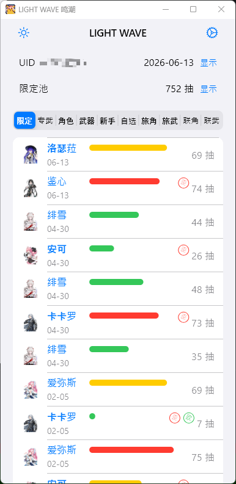
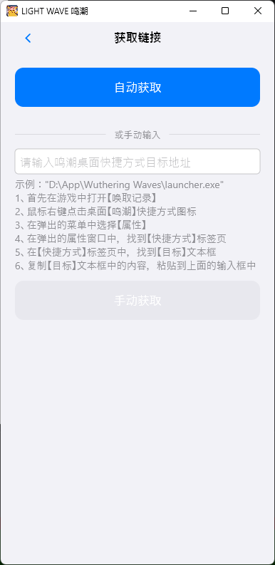
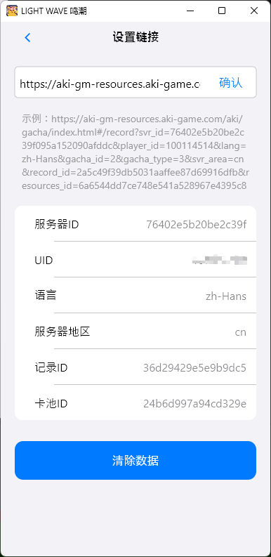

<p align="center">
  
</p>

<h1 align="center">LIGHT WAVE</h1>

<p align="center">
  <strong>一款为 <em>鸣潮</em> 打造的抽卡记录分析工具</strong>
  <br>
  Cupertino Design · 桌面端 · 简洁优雅
</p>

<p align="center">
  
  
  
</p>

---

## ✨ 功能介绍

| 功能                     | 说明                                                               |
| ------------------------ | ------------------------------------------------------------------ |
| 🔗 **PC 端获取抽卡链接** | 自动读取游戏日志文件，一键提取抽卡记录链接，无需手动抓包或配置代理 |
| 📊 **抽卡分析**          | 多卡池切换（限定/专武/常驻/新手/自选），完整抽卡历史展示           |
| 🎯 **五星进度条**        | 直观显示当前五星保底进度（距上次五星已抽多少次）                   |
| 🏷️ **欧歪标记**          | 自动标记「欧」（10 抽内出金）和「歪」（歪常驻角色）                |
| 🌐 **双服支持**          | 自动识别国服 / 国际服，切换对应的 API 端点                         |
| 🌙 **深色模式**          | 支持亮色 / 深色主题切换                                            |

---

## 📸 预览

|  首页 — 抽卡分析   | 设置 — 获取抽卡链接 | 设置 — 设置抽卡链接 |
| :----------------: | :-----------------: | :-----------------: |
|  |    |  |

---

## 🚀 使用方式

### Windows 安装

1. 从 [Releases](../../releases) 页面下载最新的 `light_waves_windows.zip`
2. 解压后运行 `light_waves.exe`
3. 应用将以 400×800 小窗置顶显示，方便边玩边看

### 获取抽卡链接

根据 Rust 参考实现（鸣潮日志读取逻辑）：

1. 打开游戏，进入 **唤取记录** 页面
2. 在应用中进入 **设置 → 获取链接**
3. 填入桌面鸣潮快捷方式的「目标」路径（右键快捷方式 → 属性 → 快捷方式 → 目标）
4. 点击「获取」，应用自动从游戏日志中提取抽卡链接
5. 复制链接，粘贴到 **设置 → 设置链接** 中即可

> 📌 也支持手动粘贴浏览器地址栏中复制的完整抽卡记录页面链接。

---

## 🛠 技术栈

| 技术                                                      | 用途             |
| --------------------------------------------------------- | ---------------- |
| [Flutter](https://flutter.dev/)                           | 跨平台 UI 框架   |
| [Dio](https://pub.dev/packages/dio)                       | HTTP 网络请求    |
| [Hive](https://pub.dev/packages/hive_flutter)             | 本地键值存储     |
| [Provider](https://pub.dev/packages/provider)             | 状态管理         |
| [window_manager](https://pub.dev/packages/window_manager) | Windows 窗口控制 |

---

## 📦 从源码构建

```bash
# 克隆仓库
git clone https://github.com/ownlight/light_waves.git
cd light_waves

# 安装依赖
flutter pub get

# 运行
flutter run -d windows
```

构建发布版本：

```bash
flutter build windows
```

---

## 📄 许可

MIT License © ownlight

---

<p align="center">
  <sub>LIGHT WAVE 是一个非官方的鸣潮社区工具，与 Kuro Games 无关。</sub>
</p>
